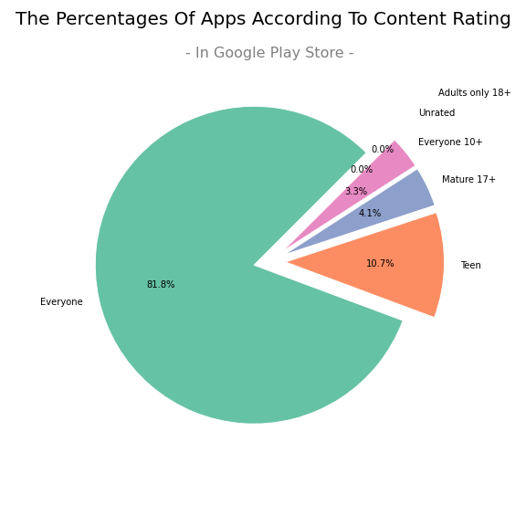
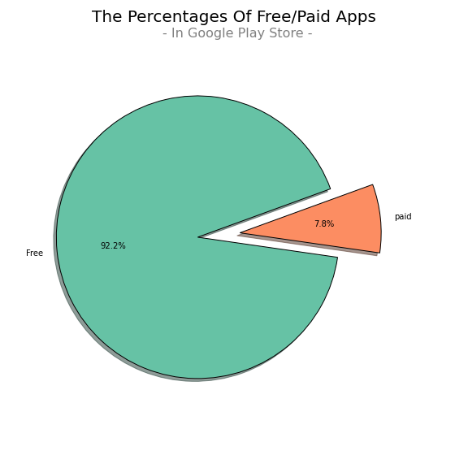

 # **Analyze Google Play Store Apps Data**
 
The final project at the SDA for Data Science bootcamp ..

<li><a href="#About The Project">About The Project</a></li>
<li><a href="#Data Description">Data Description</a></li>
<li><a href="#Objectives">Objectives</a></li>
<li><a href="#Libraries">Libraries</a></li>
<li><a href="#Results">Results</a></li>

## About The Project:
- Language 
  > Python
- Environment
  > [Google Colab](https://colab.research.google.com/notebooks/intro.ipynb)
- Data Source
  > [Kaggle](https://www.kaggle.com/) 

## Data Description:
- ### Google Play Store Apps [Dataset](https://www.kaggle.com/lava18/google-play-store-apps)  
  - **Details Of Data** :
     - App: Application name

     - Category: Category the app belongs to

     - Rating: Overall user rating of the app (as when scraped)

     - Reviews: Number of user reviews for the app (as when scraped)

     - Size: Size of the app (as when scraped)

     - Installs: Number of user downloads/installs for the app (as when scraped)

     - Type: Paid or Free

     - Price: Price of the app (as when scraped)

     - Content Rating: Age group the app is targeted at - Children / Mature 21+ / Adult

     - Genres: An app can belong to multiple genres (apart from its main category)

     - Last Updated: Date when the app was last updated on Play Store

     - Current Ver: Current version of the app available on Play Store

     - Android Ver: Min required Android version

## Objectives:
  1. To Find The Most Popular `Category` In Google Play Store .

  2. To Find What The Kind Of `Content Rating` That Most Apps Belong To In Google Play Store .

  3. Finding The Ratio Of `Paid` To `Free` Apps In Google Play Store .

  4. Find Out If There Is A Relationship Between Apps `Rating` And `Reviews` In Google Play Store .

  5. Find Out If There Is A Relationship Between App `Ratings` And Number Of `Installs` In Google Play Store .

  6. To Find Out The Most Frequently Used Value For `Rating` Apps In Google Play Store .

## Libraries:
- **Environment Setting** 
  > - **warnings** : ignore warning message
  > - **google.colab.files** : download plots 
- **Data Manipulation**
  > - **pandas** : data manipulation
  > - **numpy** : numerical operations
  > - **math** : mathematical operations 
  > - **preprocessing** : encoding operations 
- **Visualization**
  > - **matplotlib.pyplot** : visualizing data 
  > - **seaborn** : visualizing data and colors palette 
  > - **plotly.graph_objects** : interactive visualize data
- **Modeling**
  > - **sklearn.model_selection.train_test_split** : data separation to train and test 
  > - **sklearn.model_selection.GridSearchCV** : optimize score
  > - **sklearn.linear_model.LinearRegression** :  linear regression modeling
  > - **sklearn.metrics.r2_score** : getting r2_score
  > - **sklearn.metrics.mean_squared_error** : getting mean squared error
  > - **sklearn.metrics.mean_absolute_error** : getting mean absolute error
  > 

## Results:
- ### **EDA Results**
 _______________________________________________________________________________________
  -
  
  -**The Most Popular Category In The Apps Store Are Family And Games ,And The Least Popular Are Beauty Apps**
 _______________________________________________________________________________________
 - 
  - **Almost All The Applications Target "Everyone", With A Ratio Of (81.8%)**
 _______________________________________________________________________________________
 - 
 - **Most Of Application In This Store Are Free , With A Ratio Of (93.1%).**
 _______________________________________________________________________________________
 - 
 - **Most Of Application In This Store Are Free , With A Ratio Of (93.1%).**

- ### Model Results 
  > 
